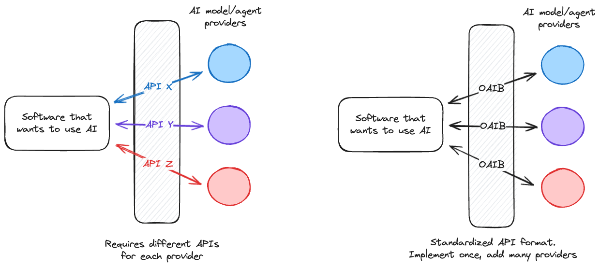
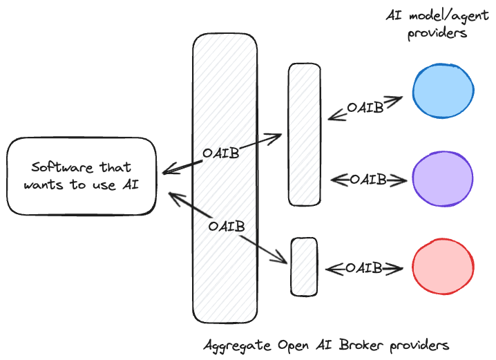

# Open AI Broker API

> [!IMPORTANT]
> The Open AI Broker API specification is in early stages and currently still being defined. We expect lots of changes before our v1.0.0 release so treat this currently as a DRAFT.

> [!INFO]
> This project is not associated with "OpenAI". You can read the full name as "The Open Source AI Broker API" to show the difference to OpenAI.

The Open AI Broker (or OAIB) API project aims to provide a set of standards to enable easier, faster connection for applications that want to use AI models and AI Agents.

## Quick links

- [GitHub discussion](https://github.com/orgs/openaibroker/discussions/3) collecting feedback and ideas for the first draft of the specification
<!-- - DRAFT - [The Open AI Broker API OpenAPI spec](./openapi.yaml) -->

## Why

Software that uses AI may wish to add functionality to select from a list of AI models and/or AI Agents. Currently there exists no standard to enable the discovery and use of these models which means that for every provider, software developers must write and maintain individual API connections or hardcode identifiers.

This open source standard tries to address this issue, providing an API specification that can be implemented by AI providers and consumed by software wanting to use AI models and Agents.

_By standardizing API endpoints, AI model and/or agent providers can be integrated faster and easier_

### Easier aggregation across multiple service providers

As the ecosystem of AI model and agent providers grows, it may be useful to aggregate multiple providers into a single API. By agreeing upon an open standard, aggregators can accept an incoming request, forward it to upstream providers (possibly with additional filters depending on their business requirements) and combine and return the response, with minimal effort or data manipulation.

_A single connection to an OAIB API may actually be querying multiple AI providers who also implement the OAIB standard enabling the use of multiple models and Agents in a single project_

## Aims of this project and the specification

The specification should be clearly defined and tailored to support the specific use case of discovering AI models and AI Agents however it must also be lightweight and flexible with a certain amount of extensibility so it can adapt to the rapidly changing landscape.

### Information that should be conveyed

We are currently collecting feedback on the key information that should be available and welcome your contributions on this [GitHub discussion](https://github.com/orgs/openaibroker/discussions/3).

### What this is not

The OAIB API standard does not currently define _how_ to use models or Agents, it is purely for discovering them and the details about them. It _may_ provide connection information - such as a URL, the model name etc. - but actual usage information will still be the responsibility of the consumer.

## Implementing the specification in your application

This project only defines the specification that should be implemented and does not provide code or libraries however as these develop and mature we plan to include links here. If you are working on an implementation please let us know so we can add a link to this README.

### Verifying your implementation of the spec

At this stage we do not provide tooling to validate your implementation of the specification however it is something we are aware of and wish to provide. To show your interest please up-vote [this discussion](https://github.com/orgs/openaibroker/discussions/2).

## Contributing

We welcome suggestions, contributions and feedback on the specification. Please use the [GitHub discussions](https://github.com/orgs/openaibroker/discussions) of this organization to engage with us and the community. We will use [GitHub issues](https://github.com/openaibroker/aibroker/issues) to track actual changes (bugs, improvements etc.) once a change has been agreed upon.

### Sponsorship

If you wish to support this project financially please subscribe to this [GitHub discussion](https://github.com/orgs/openaibroker/discussions/1) which will be updated once we have implemented financial support.

## Acknowledgements

We have to tip our hat to the [Open Service Broker](https://github.com/openservicebrokerapi/servicebroker) from Cloud Foundry which connects platforms to service providers. Their API and approach to standardization was an inspiration to this project.

## Example use cases

_Any companies or names listed here are purely done so as an example and should not be seen as an official endorsement or partnership_

### HuggingFace and other providers of AI models or Agents

By adopting the OAIB API standard, AI model providers such as HuggingFace can make it easier for developers to discover and integrate models directly into their products.

New models - optionally filtered - would be available instantly into developer products.

### LMStudio and other applications to run AI locally

Applications that help people run AI locally or within their own infrastructure likely want to make it easy for their users to discover and experiment with other models and/or Agents.

By adding the ability to consume OAIB APIs, apps like LMStudio can offer models and Agents from a variety of service providers and get access to the latest services as soon as they become available.

### Cloudflare AI - serverless inference

Cloudflare currently offers a series of [text generation AI models](https://developers.cloudflare.com/workers-ai/models/#text-generation) for developers to consume.

Should Cloudflare implement the OAIB API specification, developers - and users of their products - would be able to have instant access to the latest models.
